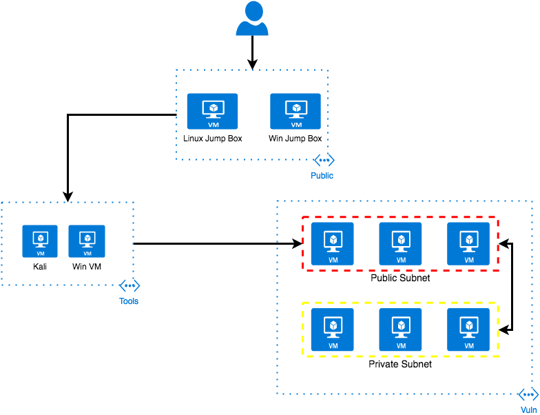

# Overview

Quickly build out a basic lab for pentesting stuff on Azure using Terraform.

# Network Architecture

Due to the sensitive nature of some of the VMs and tools you'll likely be using, this template 
builds out three seperate VNETs:

* Public (192.168.0.0/29)
  * jumpbox subnet (192.168.0.0/29)
* Tools (172.16.0.0/27)
  * default subnet (172.16.0.0/27)
* Vuln (10.0.0.0/24)
  * private subnet (10.0.0.0/28)
  * public subnet (10.0.0.16/28)

The VNETs are peered hopefully in a secure way to prevent the vulnerable VMs from being
publicly exposed. There is one entrypoint which is a jump box in the Public VNET. 
From there you would connect to one of the VMs in the Tools VNET where you would be doing
your actual work. The Vuln VNET only accepts traffic from the Tools VNET. The Tools
VNET only accepts traffic from the Public VNET. Below is a horrible image that shows
how everything is wired up:

# Stuff that is created

* Ubuntu 18.04 == jumpbox VM
* Kali == tools VM
* Windows Server 2016 == Domain controller for resources in the Vuln/private subnet

# TODO

* populate Vuln/public subnet with VMs that can be used as pivot points
* populate Vuln/private with domain joined VMs
* populate Vuln with various VMs from VulnHub, likely created via Packer
* add Windows based VMs in public and tools VNETs
